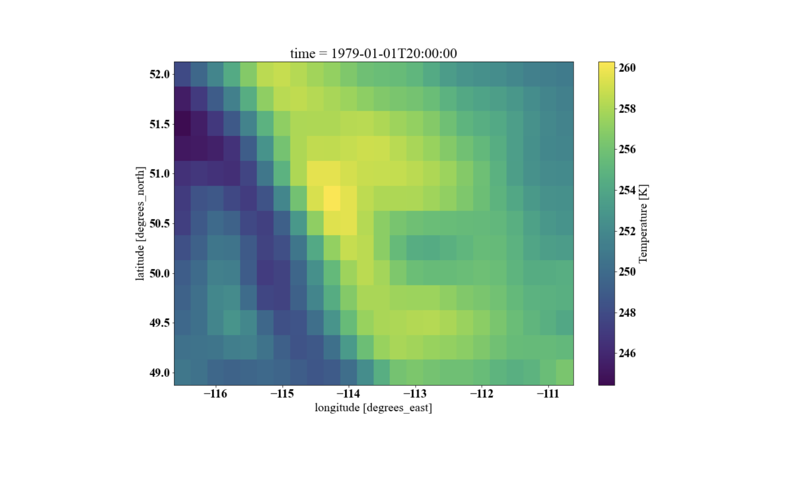
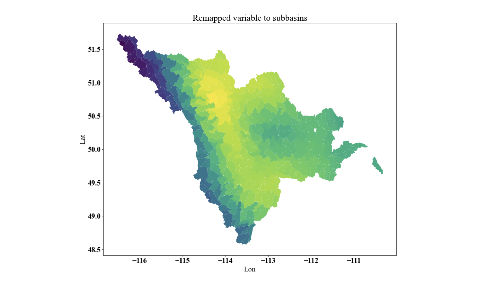

# CANDEX: CAtchment NetcDf EXtractor
This package allows you to extract and aggregate the relevant values from a
cfconventions compliant netcdf files given shapefiles.

CANDEX is a collection of functions that allows extraction of the data from a NetCDF file for a given shapefile such as a basin, catchment. It can map gridded data or model output to any given shapefile and provide area average for a target variable. CANDEX can:

1. [Remap a regular lat/lon gridded data or model to any shapefile](./candex/example_regular_lat_lon.ipynb)
2. [Remap a rotate lat/lon gridded data or model to any shapefile](./candex/example_rotated_lat_lon.ipynb)
3. Remap a non-regular shapefile data, such as Thiessen polygon for example, to any shapefile such as sub-basin.

## The code can be used for the following purposes:

1. Remapping the relevant forcing variables, such as precipitation or temperature and other variables for the effortless model set up. This transfer can be from Thiessen polygon or gridded data, for example, to computational units, hydrological model for example.
2. Remapping the output of a hydrological or land surface model to force another model, such as providing the gridded model output in sub-basin for routing.

## Example

The two figures show remapping of the gridded temperature from ERA5 data set to subbasin of South Saskatchewan River at Medicine Hat.

### Original gridded temperature field:

### Remapped temperature field to the subbasins

 
